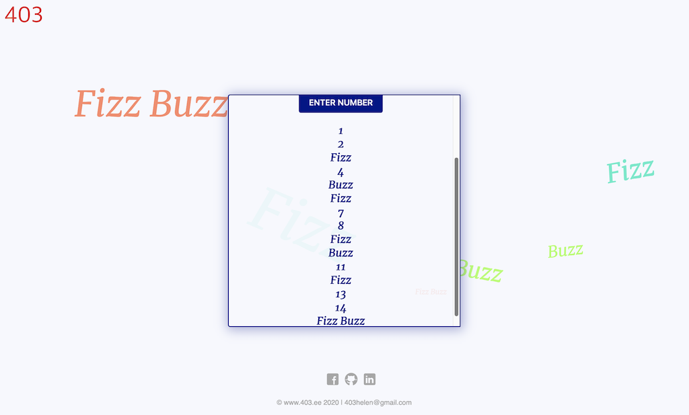

# FizzBuzz

Replacing any number divisible by three with the word "fizz", and any number divisible by five with the word "buzz". Numbers divisible by 15 become fizz buzz.

I created this to practice JavaScript.

# Created at

August 1, 2020

# Project is created with

* JavaScript
* HTML
* CSS

# View on browser

## [https://n00bg1rl.github.io/FizzBuzz/](https://n00bg1rl.github.io/FizzBuzz/)

# View as image

