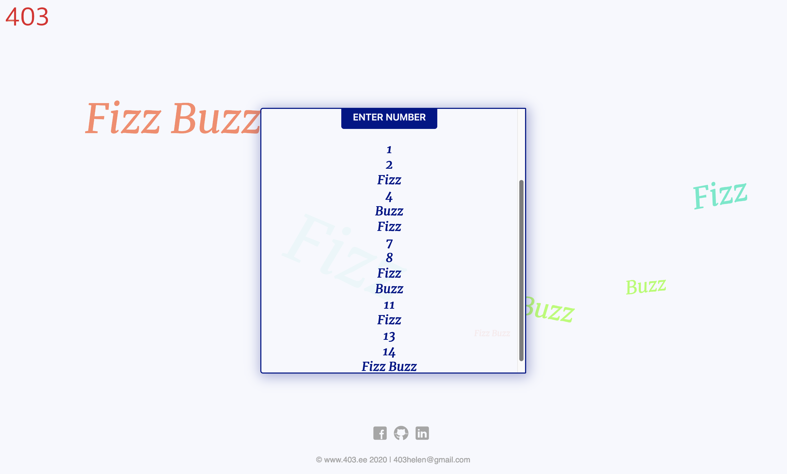

# FizzBuzz:
### Replacing any number divisible by three with the word "fizz", and any number divisible by five with the word "buzz". Numbers divisible by 15 become fizz buzz.

## Project is created with
* JavaScript
* HTML
* CSS

## Created at
Aug 1, 2020

## [View on browser](https://n00bg1rl.github.io/FizzBuzz/)

